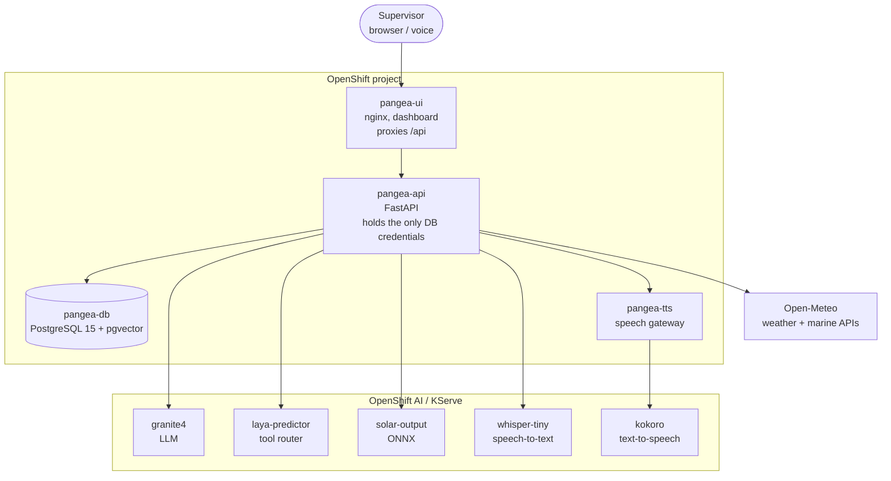

# Predict and schedule renewable energy fleet maintenance with AI

Deploy an AI operations platform for wind, solar and wave sites: output forecasting, live shutdown alerts, and a voice assistant for maintenance scheduling.

## Table of Contents

- [Overview](#overview)
- [Detailed description](#detailed-description)
  - [See it in action](#see-it-in-action)
  - [Architecture diagrams](#architecture-diagrams)
- [Requirements](#requirements)
  - [Minimum hardware requirements](#minimum-hardware-requirements)
  - [Minimum software requirements](#minimum-software-requirements)
  - [Required user permissions](#required-user-permissions)
- [Deploy](#deploy)
  - [Prerequisites](#prerequisites)
  - [Installation](#installation)
  - [Validating the deployment](#validating-the-deployment)
  - [Delete](#delete)
- [Repository structure](#repository-structure)
- [References](#references)
- [Technical details](#technical-details)
- [Tags](#tags)

## Overview

Renewable energy operators run assets that are remote, weather-dependent and
expensive to visit. A supervisor has to know which sites are producing, which
are shut down, which turbines are about to fail, and which engineer is both
qualified and on shift to fix them — usually across several disconnected
systems.

This quickstart deploys a single operations platform that answers those
questions. It forecasts output for solar and wave sites, shuts wind sites down
when the wind exceeds safe limits, tracks work orders against an engineer
roster, and puts a conversational assistant in front of all of it that
supervisors can talk to by voice or text.

It runs entirely on CPU. No GPU is required.

## Detailed description

Energy producers lose revenue in two directions: unplanned downtime when a
turbine fails without warning, and wasted truck rolls when an engineer is sent
to a site in conditions that make the work impossible. Both problems are
scheduling problems, and both depend on information that is normally spread
across a SCADA historian, a weather feed, a maintenance backlog and a staffing
spreadsheet.

The platform brings those together behind one API and one dashboard. Live
weather drives an output forecast per site, so a supervisor can see predicted
generation against what the fleet is actually producing and spot the gap.
Wind speed above the cut-out threshold automatically marks sites as shut down
and raises an alert, so nobody is dispatched into a storm. Work orders carry
the certifications and weather conditions they require, and the roster knows
who is on shift, who is on leave and who is already fully loaded.

On top of that sits the assistant. A supervisor can ask "which sites are down?"
or "who can take the yaw drive fault at Blavand this week?" and get an answer
grounded in current fleet data rather than a generic model response. A tool
router decides which fleet data each question needs, so the language model
answers from real records. Because control-room staff often have their hands
busy, the assistant accepts speech and answers aloud.

The fleet in this quickstart is fictional — eleven European sites and 104
turbines of synthetic data — so it can be deployed and explored without
connecting to real infrastructure.

| Technology | Sites |
|------------|-------|
| Wind | Calanda, Blavand, Odra, Sintra, Tabernas, Björnefjäll |
| Solar | Guadalquivir, Alentejo, Trinacria |
| Wave | Orkney, Runde |

### See it in action

> **CONTRIBUTOR TODO: add demo links**
>
> Add an Arcade interactive demo or a short video walkthrough here. Many
> reviewers will not have a cluster to hand, so this is worth adding before
> submitting for publication.

### Architecture diagrams



The browser talks only to `pangea-ui`, which reverse-proxies `/api` to the
backend on the same origin. That means no CORS configuration and no externally
reachable route for the API. `pangea-api` is the only component that holds
database credentials, which it reads from a Secret.

> **CONTRIBUTOR TODO: add a rendered diagram**
>
> Publication prefers an image file. Export the diagram above to
> `docs/images/architecture-overview.png` and reference it with alt text.

## Requirements

### Minimum hardware requirements

No GPU is required. Every model in this quickstart runs on CPU.

**Application:**

| Component | CPU (request / limit) | Memory (request / limit) |
|-----------|-----------------------|--------------------------|
| `pangea-db` | 250m / 2 | 512Mi / 2Gi |
| `pangea-api` | 50m / 500m | 128Mi / 512Mi |
| `pangea-ui` | 20m / 200m | 32Mi / 128Mi |
| `pangea-tts` | 500m / 1 | 512Mi / 1Gi |

**Models (optional, deploy only the ones you want):**

| Model | CPU (request / limit) | Memory (request / limit) |
|-------|-----------------------|--------------------------|
| `solar-output` | 2 / 3 | 4Gi / 4Gi |
| `kokoro` (TTS) | 1 / 4 | 2Gi / 4Gi |

**Storage:** 10Gi default for the database PVC, configurable with
`--set storageSize=`.

### Minimum software requirements

- Red Hat OpenShift
- Red Hat OpenShift AI — required only for the model-backed features
  (assistant, voice, solar prediction). The dashboard, alerts, wind cut-out and
  maintenance features work without it.
- `oc` CLI, authenticated against the cluster
- `helm` CLI, version 3

> **CONTRIBUTOR TODO: pin tested versions**
>
> Publication requires specific versions, e.g. "Tested with OpenShift AI
> 2.22-2.25 on OpenShift 4.14+". Fill in the versions this was actually
> validated against.

### Required user permissions

This quickstart can be deployed by any user with:

- Permission to create a project/namespace
- Permission to deploy applications via Helm and to run builds
- No cluster admin access and no custom SCC required

The database runs under OpenShift's default `restricted-v2` SCC with a random
UID. One exception: the optional MLflow tracing creates a ServiceAccount bound
to the `admin` ClusterRole within the project.

## Deploy

### Prerequisites

Before deploying, ensure you have:

- Access to an OpenShift cluster, with OpenShift AI installed if you want the
  model-backed features
- `oc` CLI installed and authenticated
- `helm` 3 installed
- No API keys needed — the weather data comes from Open-Meteo, which requires
  no authentication

### Installation

1. Clone the repository:

```bash
git clone https://github.com/rh-ai-quickstart/pangea-power.git
cd pangea-power
```

2. Create a new OpenShift project:

```bash
PROJECT="pangea-energy-and-power"
oc new-project ${PROJECT}
```

3. Install the database. The image is prebuilt, so there is nothing to build.
   The schema and demo data are applied on first start, so the pod takes
   longer than usual to become ready the first time.

```bash
helm install pangea-db database/helm/pangea-db --namespace ${PROJECT}
oc rollout status statefulset/pangea-db -n ${PROJECT}
```

To install the schema without the demo fleet, add `--set seed=false`.

> **Note:** the chart ships demo database credentials
> (`database/helm/pangea-db/values.yaml`). They are fine for a throwaway
> quickstart project, but override them for anything longer-lived:
> `--set credentials.password=<your-password>`.

4. Build and install the API. This is application code, so it is built once
   in-cluster:

```bash
cd backend
oc new-build --name pangea-api --binary --strategy=docker
oc start-build pangea-api --from-dir=. --follow

helm install pangea-api helm/pangea-api --namespace ${PROJECT}
oc rollout status deployment/pangea-api -n ${PROJECT}
cd ..
```

5. Build and install the dashboard:

```bash
cd frontend
oc new-build --name pangea-ui --binary --strategy=docker
oc patch bc/pangea-ui --type=merge \
  -p '{"spec":{"strategy":{"dockerStrategy":{"dockerfilePath":"Containerfile"}}}}'
oc start-build pangea-ui --from-dir=. --follow

helm install pangea-ui helm/pangea-ui --namespace ${PROJECT}
oc rollout status deployment/pangea-ui -n ${PROJECT}
cd ..
```

The dashboard is usable at this point. Fleet status, alerts, the wind cut-out
and maintenance all run from the database.

6. Deploy the models (optional). Each directory holds its own
   `InferenceService`. Apply the ones you want:

```bash
oc apply -f solarfarms/modelcar/inferenceservice.yaml   # solar output forecast
oc apply -f laya_custom_runtime/servingruntime.yaml     # assistant tool router
oc apply -f laya_custom_runtime/inferenceservice.yaml
oc apply -f kokoro_tts/inferenceservice.yaml            # text-to-speech
oc apply -f pangea-tts/deployment.yaml                  # speech gateway
```

The API degrades gracefully when a model is missing: the affected card or
endpoint reports itself unavailable rather than breaking the dashboard.

### Validating the deployment

1. Check all pods are running:

```bash
oc get pods -n ${PROJECT}
```

2. Confirm the API is healthy and can reach the database:

```bash
oc exec deployment/pangea-api -n ${PROJECT} -- curl -s localhost:8080/api/health
```

3. Confirm the demo fleet loaded:

```bash
oc exec statefulset/pangea-db -n ${PROJECT} -- \
  psql -U pangea_app -d pangea -c "SELECT status, count(*) FROM turbines GROUP BY status;"
```

4. Open the dashboard:

```bash
echo https://$(oc get route/pangea-ui -n ${PROJECT} --template='{{.spec.host}}')
```

You should see the welcome screen, then a fleet dashboard with live turbine
counts, total output and an active alert feed.

5. If you deployed the models, check the assistant can reach its LLM:

```bash
oc exec deployment/pangea-api -n ${PROJECT} -- curl -s localhost:8080/api/agent/health
```

### Delete

1. Uninstall the Helm releases:

```bash
helm uninstall pangea-ui pangea-api pangea-db --namespace ${PROJECT}
```

2. Remove the models, if deployed:

```bash
oc delete -f kokoro_tts/inferenceservice.yaml -n ${PROJECT}
oc delete -f laya_custom_runtime/inferenceservice.yaml -n ${PROJECT}
oc delete -f solarfarms/modelcar/inferenceservice.yaml -n ${PROJECT}
oc delete -f pangea-tts/deployment.yaml -n ${PROJECT}
```

3. The database PVC is retained deliberately so data survives a reinstall.
   Delete it explicitly if you want a clean slate:

```bash
oc delete pvc data-pangea-db-0 -n ${PROJECT}
```

4. Delete the project:

```bash
oc delete project ${PROJECT}
```

## Repository structure

```
.
├── database/                 # PostgreSQL 15 + pgvector
│   ├── helm/pangea-db/       # chart; schema and seed applied on first start
│   │   └── files/
│   │       ├── init/         # extensions, types, tables, indexes, views
│   │       └── seed/         # demo fleet: sites, turbines, readings, operations
│   └── README.md
├── backend/                  # async FastAPI service
│   ├── app/
│   │   ├── main.py           # app, CORS, lifespan, router wiring
│   │   ├── config.py         # env-driven settings
│   │   ├── laya.py           # tool-router client and context slicing
│   │   ├── tracing.py        # optional MLflow tracing
│   │   └── routers/          # fleet, turbines, alerts, solar, wave, wind,
│   │                         # operators, maintenance, voice, agent
│   ├── helm/pangea-api/      # chart; includes the assistant persona ConfigMap
│   ├── Containerfile         # UBI9 python-311
│   └── README.md
├── frontend/                 # single-file dashboard served by nginx
│   ├── dashboard-app.html
│   ├── helm/pangea-ui/
│   ├── Containerfile         # UBI9 nginx-124
│   └── README.md
├── laya_custom_runtime/      # KServe custom runtime for the tool router
├── granite-4.0-350m/         # modelcar image for the LLM
├── kokoro_tts/               # text-to-speech modelcar and InferenceService
├── pangea-tts/               # gateway adapting Kokoro on MLServer to a speech API
├── solarfarms/               # solar output ONNX model and InferenceService
├── eval/                     # MLflow eval for the assistant's tool routing
└── docs/images/              # architecture diagrams and screenshots
```

Model weights and the raw source datasets are not committed; see `.gitignore`.
Each component README covers its own build and configuration in detail.

## References

- [Red Hat OpenShift AI documentation](https://docs.redhat.com/en/documentation/red_hat_openshift_ai)
- [KServe documentation](https://kserve.github.io/website/)
- [MLflow Tracing](https://mlflow.org/docs/latest/llms/tracing/index.html)
- [pgvector](https://github.com/pgvector/pgvector)
- [Open-Meteo API](https://open-meteo.com/) — weather and marine forecasts, no key required

## Technical details

**API.** Async FastAPI over asyncpg. Read-only except `POST /api/maintenance`,
which creates a work order. Interactive docs at `/docs`. Key endpoints:

| Method and path | Returns |
|-----------------|---------|
| `GET /api/fleet/status` | Turbine counts by status, live vs rated MW |
| `GET /api/alerts?status=active` | Alert feed, merged with the live wind cut-out alert |
| `GET /api/solar/predict` | Predicted vs simulated-actual output per solar site |
| `GET /api/wave/predict` | Predicted vs actual output per wave farm |
| `GET /api/wind/status` | Live wind speed per site and cut-out shutdown state |
| `GET /api/operators` | Engineer roster: shifts, leave, assignments |
| `GET /api/operators/availability` | Per-day shift, capacity and committed hours |
| `GET /api/shifts` | Clock hours per shift |
| `POST /api/agent/chat/stream` | Chat with the assistant, SSE token stream |
| `POST /api/agent/actions/{id}/confirm` | Commit a write the assistant proposed |
| `POST /api/voice/transcribe` | Audio to text |
| `POST /api/voice/speak` | Text to WAV |

**Models.** The API holds no model weights and no inference dependencies; it is
a proxy to models served on KServe. Solar output is an XGBoost model exported
to ONNX and served on MLServer. Wave output is a physics model computed in the
API from Open-Meteo Marine sea state. The assistant uses Granite 4.0 350M with
a custom KServe runtime acting as a tool router, deciding which fleet data each
question requires before the model answers.

**Shift-aware scheduling.** `shift_definitions` pins each shift to clock hours
(day 07:00-19:00, night 19:00-07:00, on-call unscheduled), and the
`operative_shift()` / `reflow_assignments()` functions resolve the rota,
one-off exception dates and leave into the shift someone is actually working on
a given date. A work order lands at the start of its assignee's shift and fills
one shift at a time, so multi-day work runs over consecutive working days and
pauses over rest days.

`operative_availability()` resolves that precedence once, day by day, and
everything else reads it: `GET /api/operators/availability` serves the schedule
calendar, the booking form warns against it before submitting, and
`POST /api/maintenance` returns 409 rather than booking someone who is off,
short of free hours, or outside their shift window. The database is the only
place the rota is interpreted.

**Wind cut-out.** Live wind above 22 m/s (`WIND_CUTOUT_MS`) marks a site as shut
down. The resulting alert is synthesised at request time and merged into the
alert feed rather than written to the database, so it clears automatically when
the wind drops.

**Confirm-gated writes.** The assistant can raise work, but it cannot commit
any. When a message is an instruction rather than a question — matched by regex,
not by the model, because proposing a write on a misread question is worse than
missing one — the arguments are resolved **in code** to a real turbine,
operative and shift, recorded in `agent_actions` as `proposed`, and answered
with a confirm card. Granite never extracts the parameters and never sees a
write tool; it only writes the sentence above the card. Confirming replays the
proposal through `POST /api/maintenance`, so a stale proposal whose shift was
taken in the meantime is rejected like any other booking and recorded as
`failed`. Every proposal, confirmation and refusal stays on the record.

**Database.** PostgreSQL 15 with pgvector, fourteen tables covering sites,
turbines, sensor time-series, predictions, alerts, work orders, parts,
operatives, agent actions and a RAG knowledge base. TimescaleDB is deliberately
not used: its
Community features are source-available but not OSI open source, so time-series
is stored in plain tables and rolled up with materialized views. All
dependencies are OSI-approved permissive licences.

**Configuration.** Runtime settings live in the `pangea-api-config` ConfigMap
and apply with a restart, no rebuild:

```bash
oc edit configmap pangea-api-config
oc rollout restart deploy/pangea-api
```

Environment-specific endpoints ship empty rather than hardcoded, so a fresh
clone points at nothing but your own cluster. `MLFLOW_TRACKING_URI` is the main
one — tracing stays off until you set it, and the API logs
`mlflow tracing off: MLFLOW_TRACKING_URI is unset`. See
[backend/README.md](backend/README.md#mlflow-tracing) for how to set it.

**Evaluation.** `eval/pangea_tool_calling.ipynb` scores tool routing against
expected calls using MLflow's `ToolCallCorrectness` scorer in exact-match mode,
which is deterministic and needs no judge model. It runs two arms over the same
dataset: the deployed **laya** typed-decision router, and **Granite 4.0 350M
picking tools for itself** via `<tool_call>` tags — the comparison behind the
decision to route with laya rather than let the model choose.

Open the notebook and run the cells in order; cell 2 is a preflight that fails
loudly rather than scoring a broken setup. Point it at a backend first:

```bash
export PANGEA_AGENT_URL=https://$(oc get route pangea-api -o jsonpath='{.spec.host}')
```

## Tags

**Title:** Predict and schedule renewable energy fleet maintenance with AI
**Description:** Deploy an AI operations platform for wind, solar and wave sites: output forecasting, live shutdown alerts, and a voice assistant for maintenance scheduling.
**Industry:** Energy
**Product:** OpenShift AI
**Use case:** Predictive maintenance, automation
**Partner:** N/A
**Contributor org:** Red Hat

> **CONTRIBUTOR TODO: verify industry tag**
>
> `Industry` must be exactly one value from the list in the quickstart
> `CONTRIBUTING.md`. Confirm "Energy" is the accepted spelling there.
